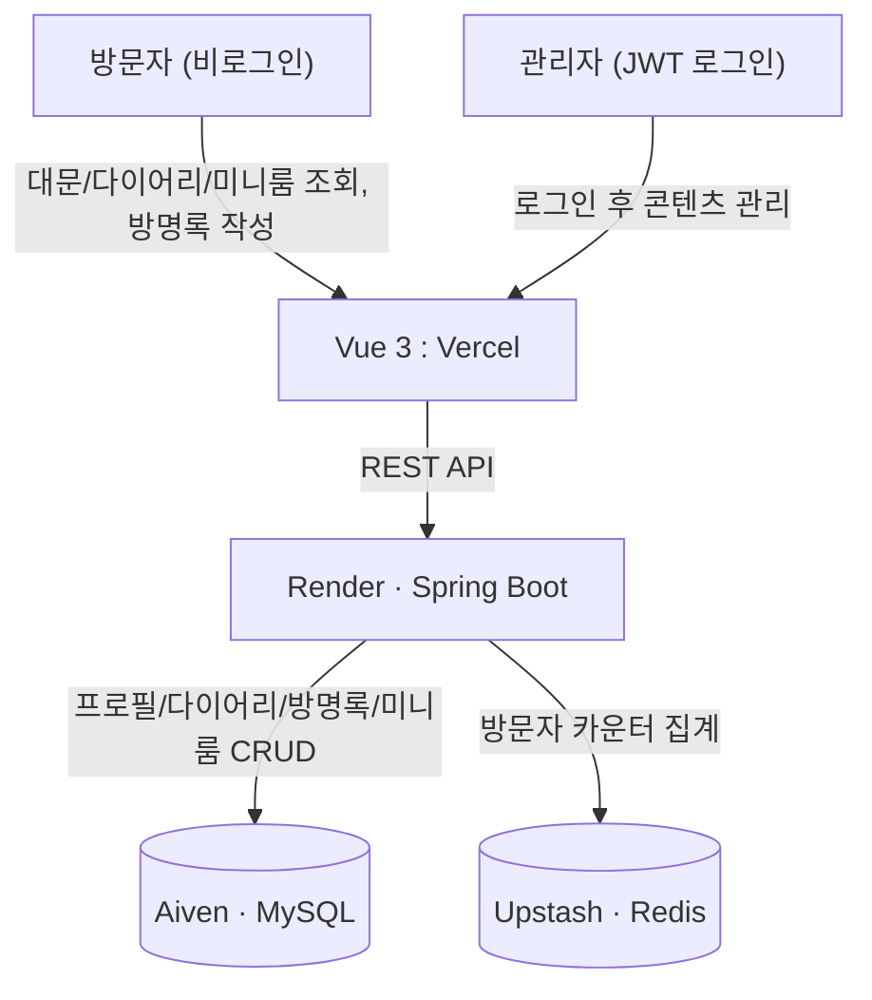

# 🏠 Mini Homepage

> 사이월드 감성의 개인 포트폴리오 사이트
> **관리자 전용 콘텐츠 관리 · 익명 방명록 · 미니룸**

---

## 📌 프로젝트 개요

회원가입/로그인이 필요한 다중 사용자 SNS가 아니라, **본인 전용 포트폴리오를 사이월드(미니홈피) UI/UX로 재해석**한 프로젝트.

콘텐츠(대문/프로필, 다이어리, 미니룸)는 관리자 1인만 로그인해서 관리하고, 방문자는 로그인 없이 조회하고 방명록에 익명으로 글을 남길 수 있다.

---

## 🛠 기술 스택

| 분류 | 기술 |
|------|------|
| Language | Java 21 |
| Framework | Spring Boot 3.x |
| 인증 | JWT (관리자 전용, Access + Refresh Token) · Spring Security |
| DB | MySQL (Aiven) |
| Cache | Redis (방문자 카운터, Upstash) |
| 마이그레이션 | Flyway |
| CI/CD | GitHub Actions |
| Frontend | Vue 3 + TypeScript + Vite + Pinia → Vercel |
| Infra | Render (Spring Boot) · Aiven (MySQL) · Upstash (Redis) |

---

## 🏗 아키텍처



---

## 🗄 ERD (초안)

```
admin
├── id (PK)
├── username (UQ)
├── password_hash
└── created_at

profile
├── id (PK)
├── name
├── intro
├── status_msg
├── photo_url
└── updated_at

diary_post
├── id (PK)
├── title
├── content
├── thumbnail_url
├── created_at
└── updated_at

guestbook_entry
├── id (PK)
├── writer_nm       (방문자가 입력한 닉네임, 계정 아님)
├── content
└── created_at

miniroom_item
├── id (PK)
├── item_type
├── pos_x
├── pos_y
└── z_index

visit_log
├── id (PK)
├── visit_date
└── count
```

> 실제 컬럼/관계는 단계별 구현하면서 조정될 수 있음.

---

## 📡 API (설계 초안)

| Method | Path | 설명 |
|--------|------|------|
| `POST` | `/api/v1/auth/login` | 관리자 로그인 (JWT 발급) |
| `POST` | `/api/v1/auth/refresh` | Access Token 재발급 |
| `GET` | `/api/v1/profile` | 프로필 조회 (공개) |
| `PUT` | `/api/v1/profile` | 프로필 수정 (관리자 전용) |
| `GET` | `/api/v1/diary` | 다이어리 목록 조회 (공개) |
| `POST` | `/api/v1/diary` | 다이어리 작성 (관리자 전용) |
| `PUT` | `/api/v1/diary/{id}` | 다이어리 수정 (관리자 전용) |
| `DELETE` | `/api/v1/diary/{id}` | 다이어리 삭제 (관리자 전용) |
| `GET` | `/api/v1/guestbook` | 방명록 목록 조회 (공개) |
| `POST` | `/api/v1/guestbook` | 방명록 작성 (공개, 익명) |
| `DELETE` | `/api/v1/guestbook/{id}` | 방명록 삭제 (관리자 전용) |
| `GET` | `/api/v1/miniroom` | 미니룸 아이템 배치 조회 (공개) |
| `PUT` | `/api/v1/miniroom` | 미니룸 아이템 배치 저장 (관리자 전용) |
| `POST` | `/api/v1/visit` | 방문 기록 (오늘/전체 카운터 증가) |

> 회원가입 API는 없음 — 관리자 계정은 배포 환경변수로만 생성.

---

## 🚀 로컬 실행

### 사전 요구사항
- JDK 21+
- Docker Desktop
- Node.js 18+

### 1. 인프라 실행
```bash
docker compose up -d
# MySQL: localhost:3307
```

### 2. 백엔드 실행
```bash
./gradlew bootRun --args='--spring.profiles.active=local'
# http://localhost:8080
```

### 3. 프론트엔드 실행
```bash
cd frontend
npm install
npm run dev
# http://localhost:5173
```

---

## 📅 개발 로드맵

- [ ] 1단계 — 기반 구축 + 관리자 인증 ([#1](https://github.com/funhappyit/mini-homepage/issues/1))
- [ ] 2단계 — 미니홈피 대문 & 프로필 ([#2](https://github.com/funhappyit/mini-homepage/issues/2))
- [ ] 3단계 — 다이어리 ([#3](https://github.com/funhappyit/mini-homepage/issues/3))
- [ ] 4단계 — 방명록 ([#4](https://github.com/funhappyit/mini-homepage/issues/4))
- [ ] 5단계 — 미니룸 꾸미기 ([#5](https://github.com/funhappyit/mini-homepage/issues/5))
- [ ] 6단계 — 감성 디테일 (방문자 카운터 & BGM) ([#6](https://github.com/funhappyit/mini-homepage/issues/6))
- [ ] 7단계 — 배포 및 마무리 ([#7](https://github.com/funhappyit/mini-homepage/issues/7))

---

## 🔗 관련 링크

- [GitHub Issues](https://github.com/funhappyit/mini-homepage/issues)
- [Frontend](#) _(배포 후 업데이트)_
- [Backend API](#) _(배포 후 업데이트)_
